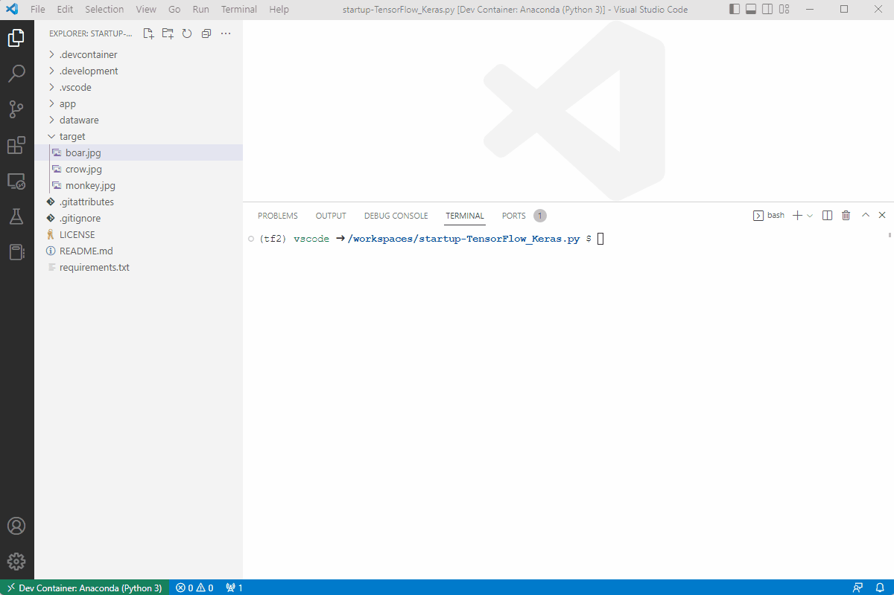

# startup-TensorFlow_Keras.py

TensorFlowとKerasの学習目的プログラム。  
画像認識がしたいよ～。  

  

## プログラム構成

```dir
- app
  - download.py (学習用画像データをダウンロード)
  - gen_data.py (画像データをnumpy配列に変換)
  - do_cnn_learn.py (モデルの生成 / 学習用プログラム)
  - predict.py (実際に予測するプログラム)
```

## 環境構築

「./.development/docs/wiki/setup.md」を参照。  

## 実行方法

※ 既にモデルデータは作成済みでGit管理対象としているため、画像の判定から始めることも可能です。  

まずは、学習用の画像ダウンロードする♪  

.envファイルに「FLICKR_KEY」「FLICKR_SECRET」の2つを指定する必要があります。  

```bash
python ./app/donload.py <学習対象のものの名前>
# ["monkey", "boar", "crow"]の3つを今回は使用します。
```

次にnumpy配列を生成。  

```bash
python ./app/gen_data.py
```

Let's Learn!!!  

```shell
python ./app/do_cnn_learn.py
```

最後に画像を判定させます。

```bash
python ./app/predict.py <判定させる画像へのパス>
```

## 参考文献

- <https://www.udemy.com/share/101Xia3@8z3Nqzdi-gXDnc_uDlbyWHwoie1Isk6Sdde_Khv91fSVIcdjBD7CqYLrKwfIGc3o2A==/>
